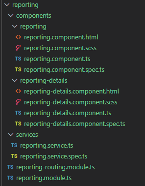
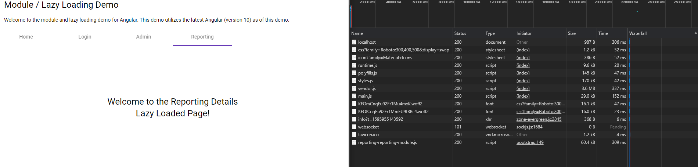

# Angular Modules and Lazy Loading

When it comes to modern web applications, developers tend to gravitate towards one of the major players in the game.  Of course, I am talking about Angular, React, and Vue.  I personally have never been dismissive of any of these frameworks/libraries and have found that they each have their own usefulness for the problem I am trying to solve. 
One of the most common things I hear about Angular is how “heavy” it is.  From a UI perspective and mobile first mentality you would not be incorrect.  The way the Angular application is generated out of the box from the CLI is great for small apps, but when you get into enterprise scale applications, using that same default box can lead to performance issues.

## The Problem
Using the Angular CLI to generate a new angular application is a best practice we should all be able to get behind.  Where issues start occurring is when we only use the AppModule exclusively to break up the code.  What does this mean?  Every import and referenced piece of code within your application is getting jammed into one main file.  The result is a larger than normal file that takes longer to download and longer to compile in the browser.  This gives the application the perception of being slow and “heavy”.

## Modules
Enter modules.  This should not be anything new to most developers.  Anyone who has seen a John Papa video on AngularJS or Angular can tell you that Ravioli code far better than spaghetti code!  Modules are a great way to break up the functionality of your application.  To fully utilize modules in Angular you need to fully understand your application.  In most enterprise scale applications, you will have functionality that belongs to specific business groups.  Organizing an application based upon these groups may make sense in some cases.  As an example, a regular user might have access to functionality specific to their role, but not access to any reports.  If certain users do not have access to application functionality, that is a good sign that the functionality should be placed in a module.  Other functionality that is great for putting into modules are common components, services, and constants that are utilized across multiple applications.  Some examples of this would be header components, authentication services, interceptors, and enums.  
While this helps organize code better, what does not help is the fact that we are still importing these modules into our main AppModule.ts file.  Because of this we are still essentially loading everything within the application that doesn’t get removed through tree shaking.  So how do we solve this?

## Lazy Loading Modules
A great rule of thumb here is if something is utilized by everyone within the application and it’s a commonly accessed feature of the application, load it.  Loading it in memory up front makes the most used portions of the application load faster at the cost of the initial load and compilation of the scripts.  For content that is specific to individual business processes or less frequently accessed, lazy loading the modules is a wonderful way to cut back the initial size of the download which in turn cuts down on initial compile time for your application.  Another great way of determining if content should be lazy loaded is in scenarios where bandwidth may be limited.  Mobile versions of enterprise applications might not allow for certain functionality to be performed on the phone, therefore making it a great candidate to be lazy loaded.

## How To
I recommend pulling down the code and following along to simplify things.
https://github.com/tallan/AngularLazyLoad.git

Let’s get started on how to implement these useful techniques.
Create an Angular application using the CLI and the command

```ng new demo --style=scss --routing=true```

Navigate to your applications directory and serve the angular application

```cd demo```

```ng serve -o ```

Angular will compile the code and show you the size of your modules.  By default, 


 
All code that you write will end up in one of two places the main bundle or the style bundle.
Let’s generate a new login component using the CLI ng g c login
 


Note that the CLI made an update to your app.module.ts file.
It has taken the liberty of assuming the login component that was generated belongs to the app module.  It has declared the component for you and automatically imported all references for you.  


When structuring your application, you can create sections within your application by separating content with folders.  Take note in the example below that when a reporting folder is created the generated components do not automatically get added to the AppModule.


 
If we want the reporting to truly be its own module, we will need to create a reporting.module.ts file.  If the module contains multiple pages we should add in a routing module just for reporting as well.
Here is an image of what the file structure looks like


 
I have added in a few additional resources such as a service and additional components to mimic a real world scenario.  You can imagine a large feature within an application that would be much larger than this!
Here is what the reporting module looks like.  There is nothing fancy going on, we are just ensuring that we only expose content that we can to be exposed.  Since I only use the MatButtonModule on the reporting page, it makes sense to put it in this module so it doesn’t get needlessly loaded in the AppModule.  


Lets take a look at the router.


At first glance there is nothing that really stands out but lets look at this in a little more detail.
We declare our routes on line 6 in the normal fashion however our route path for the reporting component is an empty string.  If report is its own module how will this work?  We don’t want users landing on this page if not everyone can use it.  The key here is in line 12.  The forChild() method will help us resolve the routes based upon the main module app.routing.

The main app routing module is where all of the magic happens.


 
On lines 9 and 10 we can utilize the loadChildren handler to import our modules whenever the user targets the specified path of reporting or admin.  What this allows for is the lazy loading of the module and the assignment of the root path of that specific module to be reporting or admin.
The end result would be /reporting for the reporting page, and /reporting/details for the report details page!
When these routes are activated the lazy loading occurs and the module is cached unless the application is reloaded.  This means you can bounce around from page to page without having to worry about waiting for the content to reload.
This can be visualized in the browsers developer tools network tab.
On initial load of the home page we can see the entire app get downloaded.


When switching to the login page, there are no additional calls.  Even though this is in its own module, it is references within the app module and is brought into the application on load.


Ok lets see what happens when we trigger the reporting route!


You can see we have a new network call for reporting-.reporting-module.js
This module was lazy loaded and cached in the browser on demand.  Because of this I can now navigate to any other routes in this module and not suffer a performance hit.  I can also leave this page completely and return to it and the content will still be cached.  Note that clicking on the go to details button directs be to the details page with no additional calls!


 
So at this point if I never needed to go to the admin page, I would have never of loaded any of that functionality.  But just to showcase lazy loading one more time, lets activate that route.


 
As expected, I can now see an admin-admin-module.js resource call in the network tab!  You can really begin to see the benefits of lazy loading the applications especially when you get into scenarios where bandwidth may be limited.
To take a deeper look into the code, check out our example repository!
